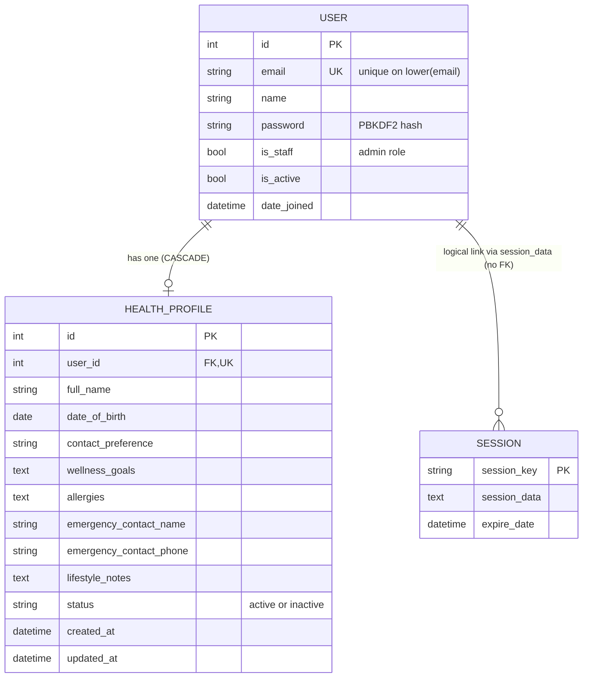

```mermaid
erDiagram
    USER ||--o| HEALTH_PROFILE : "has one (CASCADE)"
      USER ||--o{ SESSION : "logical link via session_data (no FK)"
    USER {
        int id PK
        string email UK "unique on lower(email)"
        string name
        string password "PBKDF2 hash"
        bool is_staff "admin role"
        bool is_active
        datetime date_joined
    }
    HEALTH_PROFILE {
        int id PK
        int user_id FK,UK
        string full_name
        date date_of_birth
        string contact_preference
        text wellness_goals
        text allergies
        string emergency_contact_name
        string emergency_contact_phone
        text lifestyle_notes
        string status "active or inactive"
        datetime created_at
        datetime updated_at
    }
    SESSION {
        string session_key PK
        text session_data
        datetime expire_date
    }
```